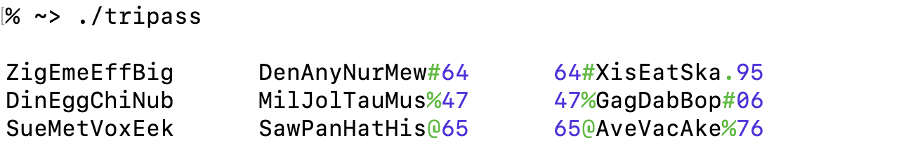
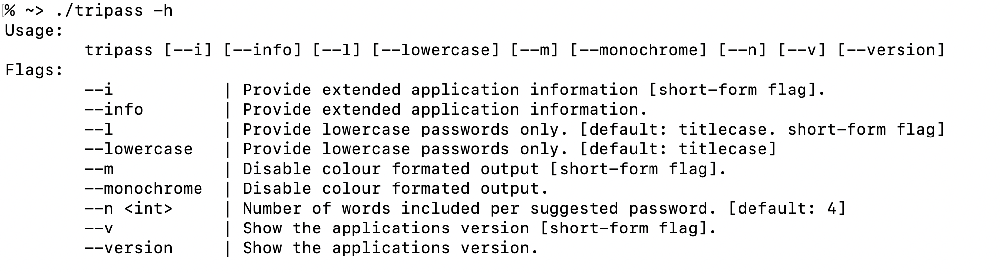
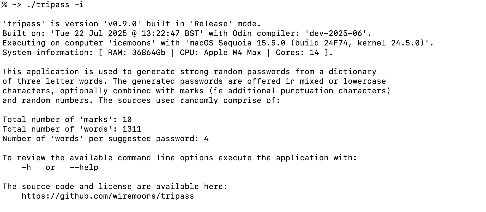

# tripass
tripass : cli password generator that uses a dictionary of three letter words.

**WORK IN PROGRESS** : project to try out Odin programming language. Now fully functional since v0.9.0.

## SCREENSHOTS

Default output:


CLI options:


Additional info output:



## HOW TO BUILD

The steps below assume a working install of the Odin compiler. Full instructions are available on the [Odin](https://odin-lang.org/) web site if needed.

To clone and build for first time:
```
git clone --recurse-submodules https://github.com/wiremoons/tripass.git
cd tripass
git submodule update --remote --merge
./build.sh
./tripass
```

To refresh a previous clone and re-build:
```
cd tripass
git pull --recurse-submodules
git submodule update --remote --merge
./build.sh
./tripass
```

## LICENSE

The program is licensed under the "MIT License" see
http://opensource.org/licenses/MIT for more details.

Copy of the [tripass license](./LICENSE)